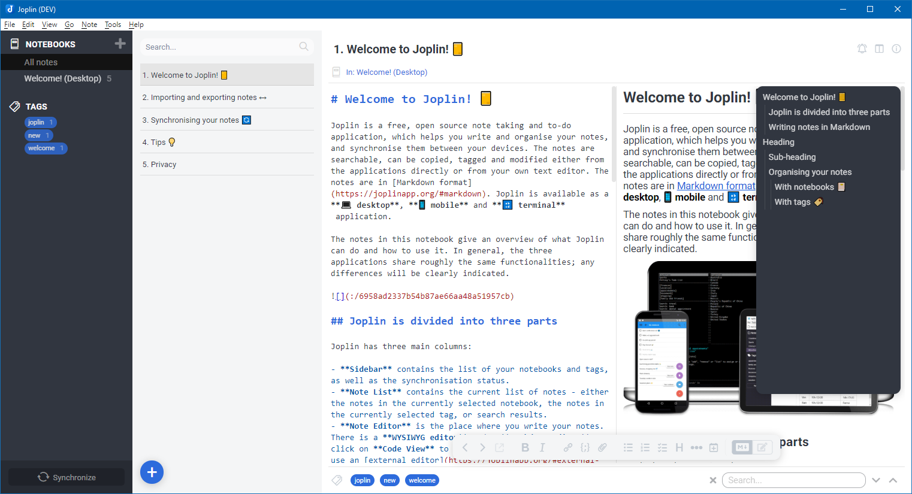

# Joplin - Wanaka UI

_joplin-wanaka-ui_ is a theme to adapt the UI of [Joplin's](https://joplinapp.org/) desktop application.

> **Visit [Lake Wanaka](https://www.newzealand.com/int/lake-wanaka/) in New Zealand! :wink:**

> **NOTE** - This theme works with all built-in color themes

> :warning: **CAUTION** - This theme requires at least version **v1.4.10**

## Table of contents

- [Features](#features)
- [Screenshots](#screenshots)
- [Installation](#installation)
- [UI tweaks](#ui-tweaks)
- [Feedback](#feedback)
- [Changes](#changes)
- [License](#license)

## Features

This theme changes the following parts of the user interface.

- Colored tags
- Cleaner note list including floating plus button to create new notes/to-dos
- Floating editor toolbar at the bottom of the editor content
  - Not supported for TinyMCE
- Local search inlined within tag list
- Improved style of panel splitters
  - Highlighted while dragging
- Changed style of synchronize area and button
- Decreased visibility of toolbar icons
  - To focus more on content
- Floating TOC on the right for rendered Markdown mode
  - Based on the idea from [here](https://discourse.joplinapp.org/t/toc-as-the-sidebar/5979/34)
  - Requires `[[toc]]` in note content
- Show/hide line numbers in CodeMirror
  - Based on the idea from [here](https://discourse.joplinapp.org/t/option-to-show-line-numbers-in-editor/8313/22)
- Changed visibility of some UI elements by default
  - Can be adapted manually - see [UI tweaks](#ui-tweaks)

## Screenshots

### Light Theme

### Dark Theme

## Installation

- Open Joplin
- Open the user profile directory via `Help > Open profile directory`
- Download the latest [userstyle.css](./theme/userstyle.css) and [userchrome.css](./theme/userchrome.css) into the opened user profile directory
- Restart Joplin to see the changes

## UI tweaks

- Open Joplin
- Navigate to `Tools > Options > Appearance`
- Click `Show Advanced Settings`
- Click `Edit` below `Custom stylesheet for rendered Markdown` to open `userstyle.css` in a text editor
- Click `Edit` below `Custom stylesheet for Joplin-wide app styles` to open `userchrome.css` in a text editor
- Search for `TWEAK` and change the styles as described if you want
- Save your changes and restart Joplin to see the changes

## Feedback

If you need help or found a bug, open an issue on [GitHub](https://github.com/benji300/joplin-wanaka-ui/issues).

## Changes

See [CHANGELOG](./CHANGELOG.md) for details.

## License

Copyright (c) 2020 Benjamin Seifert

MIT License. See [LICENSE](./LICENSE) for more information.
