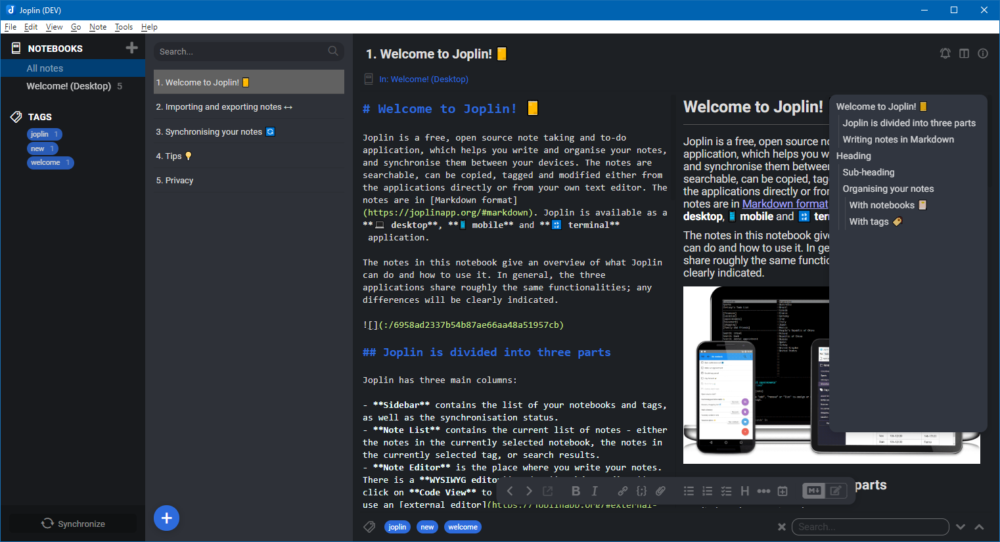

# Joplin - Wanaka UI

_joplin-wanaka-ui_ is a theme to adapt the UI of [Joplin's](https://joplinapp.org/) desktop application.

> **NOTE** - Tested with Joplin **v1.4.9**.

> **Visit [Lake Wanaka](https://www.newzealand.com/int/lake-wanaka/) in New Zealand! 😉**

## Table of contents

- [Features](#features)
- [Screenshots](#screenshots)
- [Installation](#installation)
- [UI tweaks](#ui-tweaks)
- [Support](#support)
- [Changes](#changes)
- [License](#license)

## Features

This theme changes the following parts of the user interface.

- Colored tags
- Cleaner note list including floating plus button to create new notes/to-dos
- Floating editor toolbar at the bottom of the content (not supported for TinyMCE)
- Local search inlined with tag list
- Improve style of column splitters (highlight while dragging)
- Change style of synchronize area and button
- Decrease visibility of toolbar icons (to focus more on content)
- Floating TOC on the right for rendered Markdown mode
  - Based on the idea from [here](https://discourse.joplinapp.org/t/toc-as-the-sidebar/5979/34)
- Change visibility of some UI elements
  - Can be reverted manually - see [UI tweaks](#ui-tweaks)
- Works with all built-in color themes

## Screenshots

### Light Theme

### Dark Theme

## Installation

- Open Joplin

- Navigate to `Joplin > Preferences > Appearances`

- Click `Advanced Settings`

- Click `Custom stylesheet for rendered Markdown` and paste the content from [userstyle.css](./theme/userstyle.css)

- Click `Custom stylesheet for Joplin-wide app styles` and paste the content from [userchrome.css](./theme/userchrome.css)

- Save your changes and restart Joplin to see the changes

## UI tweaks

- Open Joplin

- Navigate to `Joplin > Preferences > Appearances`

- Click `Advanced Settings`

- Click `Custom stylesheet for rendered Markdown` to open `userstyle.css` in any text editor

- Click `Custom stylesheet for Joplin-wide app styles` to open `userchrome.css` in any text editor

- Search for `TWEAK` and change the styles as described if you want

- Save your changes and restart Joplin to see the changes

## Support

If you need help or found a bug, open an issue on [GitHub](https://github.com/benji300/joplin-wanaka-ui/issues).

## Changes

See [CHANGELOG](./CHANGELOG.md) for details.

## License

Copyright (c) 2020 Benjamin Seifert

MIT License. See [LICENSE](./LICENSE) for more information.
